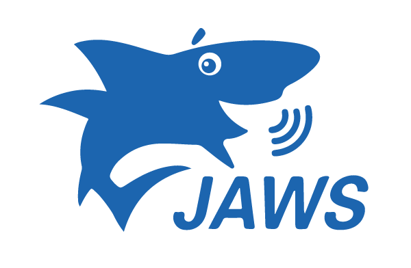

import { Tabs, TabItem, CardGrid, Card } from '@astrojs/starlight/components';
import KeyboardShortcuts from '@components/vue/KeyboardShortcuts.vue'

<Tabs>
  <TabItem label="NVDA">Bild NVDA</TabItem>
  <TabItem label="JAWS">
  - Bild JAWS
  - Tastebjinbus und Funktionen

## Content Logo

JAWS - Job access with System

JAWS - Job access with System

## Tastenkombinationen
<KeyboardShortcuts />

Enter

Bestätigung

  </TabItem>
</Tabs>

col

col

col

